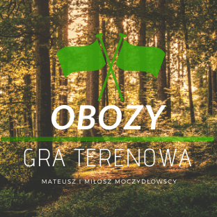

<a name="readme-top"></a>


<!-- PROJECT SHIELDS -->
[![Contributors][contributors-shield]][contributors-url]
[![Forks][forks-shield]][forks-url]
[![Stargazers][stars-shield]][stars-url]
[![Issues][issues-shield]][issues-url]
[![MIT License][license-shield]][license-url]


<!-- PROJECT LOGO -->
<br />
<div align="center">
  <a href="https://github.com/dudematthew/obozy-website">
    
  </a>

  <h3 align="center">OBOZY WEBSITE</h3>

  <p align="center">
    This repository was created to showcase the Obozy - Gra Terenowa event, which takes place annually in the Opolskie Voivodeship in Poland. It provides information about the nature of the game, invites people to get in touch, and encourages them to join in the fun.
    <br />
    <a href="http://www.obozygraterenowa.pl"><strong>Explore the website »</strong></a>
    <br />
    <a href="https://github.com/dudematthew/obozy-website/issues">Report Bug</a>
    ·
    <a href="https://github.com/dudematthew/obozy-website/issues">Request Feature</a>
  </p>
</div>


<!-- TABLE OF CONTENTS -->
<details>
  <summary>Table of Contents</summary>
  <ol>
    <li>
      <a href="#about-the-project">About The Project</a>
      <ul>
        <li><a href="#built-with">Built With</a></li>
      </ul>
    </li>
    <li>
      <a href="#getting-started">Getting Started</a>
      <ul>
        <li><a href="#prerequisites">Prerequisites</a></li>
        <li><a href="#installation">Installation</a></li>
      </ul>
    </li>
    <li><a href="#usage">Usage</a></li>
    <!-- <li><a href="#roadmap">Roadmap</a></li> -->
    <li><a href="#contributing">Contributing</a></li>
    <li><a href="#license">License</a></li>
    <li><a href="#contact">Contact</a></li>
    <li><a href="#acknowledgments">Acknowledgments</a></li>
  </ol>
</details>


<!-- ABOUT THE PROJECT -->
## About The Project

<!-- [![Product Name Screen Shot][product-screenshot]](https://example.com) -->

The Obozy Website is designed to promote and facilitate the Obozy - Gra Terenowa event. It provides a platform for participants to learn about the game, its rules, and its objectives. The website also serves as a central hub for communication, allowing interested individuals to contact the organizers and express their interest in participating.

<p align="right">(<a href="#readme-top">back to top</a>)</p>


### Built With

* [![Vue][Vue.js]][Vue-url]
* [![Bulma][Bulma]][Bulma-url]
* [![Babel][Babel]][Babel-url]

<p align="right">(<a href="#readme-top">back to top</a>)</p>


<!-- GETTING STARTED -->
## Getting Started

### Prerequisites

*  npm
  ```sh
  npm install npm@latest -g
  ```

### Installation

1. Clone the repo
   ```sh
   git clone https://github.com/dudematthew/obozy-website.git
   ```
2. Install NPM packages
   ```sh
   npm install
   ```
3. Run server
   ```sh
   npm run serve
   ```

<p align="right">(<a href="#readme-top">back to top</a>)</p>


<!-- USAGE EXAMPLES -->
## Usage

  After build, the app will be available under `dist`

  Build
   ```sh
  npm run build
  ```

<p align="right">(<a href="#readme-top">back to top</a>)</p>


<!-- ROADMAP -->
<!-- ## Roadmap

- [x] Add Home Page
- [x] BOOST Manual Page
- [x] User Panel
- [x] Game Master Panel
- [ ] Multi-language Support
    - [x] Polish
    - [ ] English

See the [open issues](https://github.com/dudematthew/boost-rpg-tools/issues) for a full list of proposed features (and known issues).

<p align="right">(<a href="#readme-top">back to top</a>)</p> -->


<!-- CONTRIBUTING -->
## Contributing

Contributions are what make the open source community such an amazing place to learn, inspire, and create. Any contributions you make are **greatly appreciated**.

If you have a suggestion that would make this better, please fork the repo and create a pull request. You can also simply open an issue with the tag "enhancement".
Don't forget to give the project a star! Thanks again!

1. Fork the Project
2. Create your Feature Branch (`git checkout -b feature/AmazingFeature`)
3. Commit your Changes (`git commit -m 'Add some AmazingFeature'`)
4. Push to the Branch (`git push origin feature/AmazingFeature`)
5. Open a Pull Request

<p align="right">(<a href="#readme-top">back to top</a>)</p>


<!-- LICENSE -->
## License

Distributed under the MIT License. See `LICENSE.txt` for more information.

<p align="right">(<a href="#readme-top">back to top</a>)</p>


<!-- CONTACT -->
## Contact

@dudematthew - mmoczydlowski4@gmail.com

Project Link: [https://github.com/dudematthew/obozy-website](https://github.com/dudematthew/obozy-website)

<p align="right">(<a href="#readme-top">back to top</a>)</p>


<!-- ACKNOWLEDGMENTS -->
## Acknowledgments

* [MIT License](https://choosealicense.com/licenses/mit/)
* [Img Shields](https://shields.io)
* [GitHub Pages](https://pages.github.com)
* [Font Awesome](https://fontawesome.com)

<p align="right">(<a href="#readme-top">back to top</a>)</p>


<!-- MARKDOWN LINKS & IMAGES -->
<!-- https://www.markdownguide.org/basic-syntax/#reference-style-links -->
[contributors-shield]: https://img.shields.io/github/contributors/dudematthew/obozy-website.svg?style=flat-square
[contributors-url]: https://github.com/dudematthew/obozy-website/graphs/contributors
[forks-shield]: https://img.shields.io/github/forks/dudematthew/obozy-website.svg?style=flat-square
[forks-url]: https://github.com/dudematthew/obozy-website/network/members
[stars-shield]: https://img.shields.io/github/stars/dudematthew/obozy-website.svg?style=flat-square
[stars-url]: https://github.com/dudematthew/obozy-website/stargazers
[issues-shield]: https://img.shields.io/github/issues/dudematthew/obozy-website.svg?style=flat-square
[issues-url]: https://github.com/dudematthew/obozy-website/issues
[license-shield]: https://img.shields.io/github/license/dudematthew/obozy-website.svg?style=flat-square
[license-url]: https://github.com/dudematthew/obozy-website/blob/master/LICENSE
[product-screenshot]: images/screenshot.png
<!-- https://simpleicons.org -->
[Vue.js]: https://img.shields.io/badge/Vue.js-35495E?style=for-the-badge&logo=vuedotjs&logoColor=4FC08D
[Vue-url]: https://vuejs.org/
[Bulma]: https://img.shields.io/badge/Bulma-white?style=for-the-badge&logo=bulma&logoColor=00D1B2
[Bulma-url]: https://bulma.io/
[Babel]: https://img.shields.io/badge/Babel-3B3C38?style=for-the-badge&logo=babel&logoColor=#F9DC3E
[Babel-url]: https://babeljs.io/
