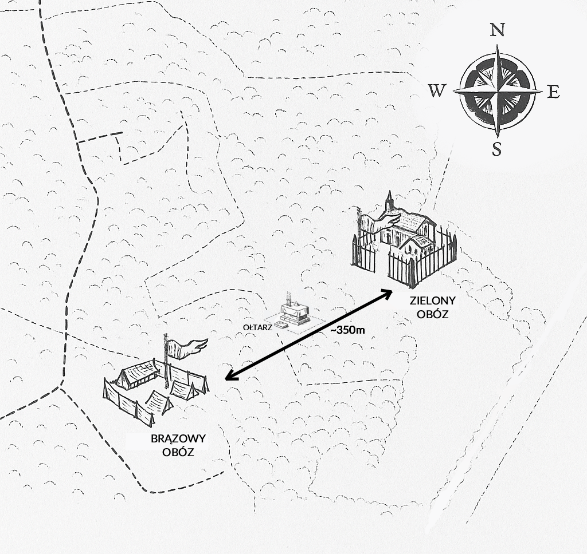
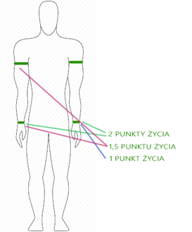
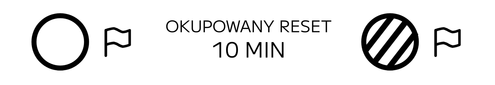
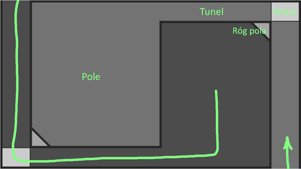
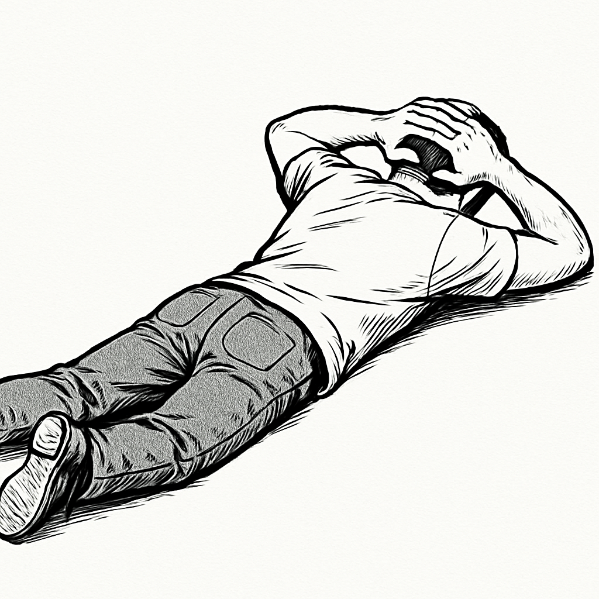

# OBOZY – GRA TERENOWA

***INSTRUKCJA GRY***

Obozy – Gra Terenowa to wielogodzinna gra terenowa dwóch obozów: flaga, punkty zwycięstwa, walka na bibuły, zwoje i negocjacje dowódców.

## Teren i obozy

Gra odbywa się na terenie umożliwiającym rozłożenie dwóch **obozów** — każdy bez problemu pomieści połowę uczestników. Obozy na dwóch krańcach terenu, niewidoczne z obozu przeciwnego. Dojście normalnym tempem między obozami powinno trwać **powyżej czterech minut**; optymalna odległość to ok. **350 metrów**.

Między obozami: zasłony terenowe, atrakcyjne miejsca na rozgrywkę oraz [ołtarz rytualny](glossary:oltarz_rytualny) (opisany później). Każdy obóz budowany jest tak, by możliwości były równe — zasada *fair play* w 100%.

## Rozłożenie drużyn

Gracze ustawiają się przed dwoma [dowódcami](glossary:dowodca), którzy na zmianę wybierają po jednej osobie, aż wyczerpią skład. Wybrani ustalają **klasy** (patrz [Klasy i przeklasowanie](#klasy-i-przeklasowanie)).

Powstają **dwie drużyny** w obozie zielonym lub brązowym. Wybór obozu należy do dowódcy, który jako drugi wybrał pierwszego członka.

## Cel gry i punkty

Każdy obóz ma **flagę** w kolorze obozu. Celem jest zdobycie jak największej liczby **[punktów zwycięstwa](glossary:punkt_zwyciestwa)** — za **odebranie flagi przeciwnika** i dostarczenie jej do miejsca przechowywania we własnym obozie. Możliwe jest też zwycięstwo przez śmierć wszystkich graczy przeciwnika (wszyscy wracają do obozów; liczy się stan przy **zakończeniu gry**).

> [!NOTE]
>
> Można zdobyć **pół punktu zwycięstwa** (np. rytuał na ołtarzu). Dwa pół punkty dają jeden pełny punkt jak zwykły punkt zwycięstwa.

## Sposób walki i Duch

Gracze walczą przez **kolorowe bibuły** na rękach (kolor obozu). Aby unieszkodliwić przeciwnika, **zerwij** bibułę na jego ręce. Bez bibuły życia gracz jest **[martwy](glossary:duch)** ([Duch](glossary:duch)) i idzie do [**cmentarza**](#cmentarz).

Martwi upuszczają przedmioty rozgrywkowe (z wyjątkiem klasowych i prywatnych), trzymają **skrzyżowane ręce**, nie wpływają na grę ani nie przekazują informacji do odrodzenia. Szczegóły zależą od [klasy](glossary:klasa) — patrz Karta Właściwości Klas.

## Bibuły

Na rękach są bibuły życia (kolor obozu) i ewentualnie srebrna **umiejętność klasy** (agrafka na piersi). Gracz sam wybiera, na której ręce trzyma którą bibułę.

- Bibuły życia: zwykle nadgarstek, grubość min. **3 cm**, dwa okręcenia (połowy życia czasem na ramieniu — sznurek/agrafka zalecane).
- Bibuły można zastąpić biodegradowalnymi workami ciętymi w paski.

## Cmentarz

<!-- manual:tag reference_card -->
**Cmentarz** to wyraźnie oznaczone miejsce w każdym obozie (max. **15%** powierzchni obozu), rogi oznaczone fioletowymi **palikami**. [Duch](glossary:duch) powinien tam przebywać przez **czas odradzania** zależny od klasy (Karta Właściwości Klas).

Jeśli żaden wróg nie jest w zasięgu wzroku, duch może poruszać się po swoim obozie ze skrzyżowanymi rękami na piersi.

## Zamrożenie

**Efekt zamrożenia** nakładany jest m.in. zwojem lub umiejętnością klasy (Karta Zwojów / Karta Właściwości Klas). Zamrożony gracz **nie rusza ciałem ani nie wydaje dźwięku**; jeśli był w ruchu — szybko zatrzymuje się i podnosi **wyprostowaną rękę nad głowę**.

Zamrożonego **nie wolno dotykać** (wyjątek: pojmanie, lekki dotyk Magiczną Laską bez siły). Inni trzymają ok. **20 cm** od ciała. Przed zamrożeniem osoby dotykające muszą się odsunąć. Nie wolno zrywać bibuł zamrożonym ani wywierać siły.

## Medyk i półżywy duch

<!-- manual:tag advanced -->
Jeśli w grze jest **Medyk**, może raz na jakiś czas wskrzesić **Szturmowca** (Karta Właściwości Klas). Duch idzie do Medyka i czeka na zawiązanie bibuły; do tego czasu jest „pomiędzy życiem a śmiercią”. Przerwanie: śmierć lub pojmanie Medyka, odejście Ducha z pola widzenia lub rezygnacja Ducha.

## Klasy i przeklasowanie

<!-- manual:tag reference_card -->
**Klasa** to zestaw atrybutów na całą rozgrywkę (cztery klasy do wyboru na start). **Przeklasowanie** — obaj dowódcy zgadzają się na zmianę; wszyscy muszą wiedzieć. Nie przeklasowuje się [martwego](#sposób-walki-i-duch) ani [pojmanego](#pojmanie-i-więzienie).

Niektóre klasy (np. **Tank**) mają umiejętność klasy — powrót po ok. **15 sekundach** w swoim obozie. Pełny opis klas: **Karta Właściwości Klas**.

## Dowódca i poddowódca

<!-- manual:tag commander -->
[Dowódcy](glossary:dowodca) pilnują zasad i taktyki; mają klasę **Dowódca**. Gdy dowódca zginie lub zostanie pojmany, dowodzenie przejmuje **poddowódca** (nakładka na klasę — Karta Właściwości Klas). Zasady ustala nadal dowódca; poddowódca nie przeklasowuje dowódcy bez jego zgody.

## Flaga

[Flaga](glossary:flaga) na kiju **powyżej 1,8 m**, wbitym w grunt naturalny (nie doniczka). W promieniu **1 m** od flagi — nic nie może zasłaniać ani blokować dostępu.

Odebranie flagi: przemieścić kij lub zerwać flagę i dostarczyć do miejsca przechowywania flag we własnym obozu. **Nie można zdobyć punktu, jeśli własna flaga też nie jest w obozie** — najpierw odzyskaj własną.

> [!WARNING]
>
> **Flaga zawsze musi być widoczna** — nie wolno jej chować. Przy przenoszeniu — na wyciągniętej ręce, tak by każdy widział, że ją niesiesz.

## Lockdown i reset

<!-- manual:tag advanced -->
<!-- manual:tag commander -->
Czasem flaga ginie w akcji — przewidziano **reset** (jak zdobycie flagi, bez punktu) oraz **[okupację](glossary:okupacja)** (wszyscy wrogowie usunięci z obozu; trwa, dopóki okupant w pełni nie opuści obozu).

### Lockdown

[Lockdown](glossary:lockdown): obóz ma flagę w terenie, jest okupowany, okupant ma flagę u siebie — **odradzanie okupowanego zablokowane**. Po **20 minutach** okupant zdobywa punkt i następuje [reset](glossary:reset).

#### Lockdown — diagram

### Pusty reset

Obie flagi w terenie, brak okupanta — po **10 minutach** [reset](glossary:reset).

#### Pusty reset — diagram

### Okupowany reset

Obie flagi w terenie, jeden okupant — po **10 minutach** reset.

#### Okupowany reset — diagram

### Wymiana

Obie drużyny wymieniły się flagami, brak okupanta — **natychmiastowy** reset.

#### Wymiana — diagram

## Pojmanie i więzienie

Aby **[pojmać](glossary:pojmanie)** wroga: [zamroź](#zamrożenie) go (zwój, laska itd.), połóż rękę z **pętem** na ramieniu, powiedz „**pojmanie**", **odlicz głośno do 30**, nałóż **[pęto](glossary:peto)** (bibuła na szyi).

Pojmany: ręce za plecami, bez używania rąk, bez manipulacji pętem; dotknięty przez wroga nie może się wyrwać, może uciec od swoich. Bez umiejętności klasy i bez samozerwania bibuły życia w schwytaniu. Inni mogą zerwać pęto — anuluje schwytanie.

W obozie jest **więzienie** (żółte paliki w rogach). W więzieniu nie ucieka się samemu; wróg nie zrywa pęt bez **sabotażu** (wyciągnięcie ≥2 palików ramy). Palików nie kradnie się — odrzuca blisko w widoczne miejsce. Obóz zapewnia więźniom komfort.

Więźniami handluje się jak walutą. Zerwanie bibuły życia więźnia = śmierć i utrata pęta. Po zdobyciu flagi przez dowolny obóz **wszyscy więźniowie są zwalniani**.

## Rytuał na ołtarzu

Po [pojmaniu](#pojmanie-i-więzienie) można poświęcić jeńca za **pół [punktu zwycięstwa](glossary:punkt_zwyciestwa)**.

Przetransportuj jeńca na **[ołtarz rytualny](glossary:oltarz_rytualny)** — neutralne jednoosobowe więzienie w równej odległości od obozów. **Szaman** (Chochlik z nakładką — Karta Właściwości Klas) dotyka jeńca Laską; jeniec odlicza na stoperze (zatrzymuje, gdy nie dotyka laska). Śmierć Szamana = rytuał od początku; wyciągnięcie dwóch palików ołtarza i uwolnienie jeńca = porażka.

Rytuał ma być **widoczny**; jeniec na pytanie podaje pozostały czas. Po **25 minutach** rytuał się udaje — jeniec umiera, obóz Szamana dostaje pół punktu. **Raz na dowolne zdobycie flagi** przez obóz.

> [!NOTE]
>
> Ołtarz w tej grze służy rytuałowi — nie mylić z mechaniką ołtarzy w [Obozy – Mayhem](/instrukcja/mayhem).

## Handel i kradzież

<!-- manual:tag commander -->
Można **kraść** nieprywatne przedmioty z obozu wroga; wyznaczony obszar (**max. 30%** obozu) jest nietykalny (ustala dowódcy). Obozy muszą mieć m.in. **siekierę** i **łopatę** — skradzione narzędzia zwraca się niezwłocznie.

O kradzieży zwojów: [Zwoje](#zwoje). O dropie przy śmierci: [Sposób walki](#sposób-walki-i-duch).

Skradzionymi rzeczami, przywilejami i **więźniami** handlują **dowódcy** na [Strefie neutralnej](#strefa-neutralna) po umówionym sygnale. Dowódcy i eskorta są chronieni do powrotu — powrót **natychmiastowy**.

> [!WARNING]
>
> Handel niematerialny jest chroniony zasadami gry — złamanie umowy to kara **utratą punktu zwycięstwa**.

## Strefa neutralna

[Strefa neutralna](glossary:strefa_neutralna) łączy zasady [**Areny**](#arena), [**handlu**](#handel-i-kradzież) i [**zawieszenia broni**](#pory-posiłków-i-zawieszenia-broni). W środku **zakaz działań ofensywnych**; w trakcie gry gracze nie wchodzą (wyjątki: arena, zawieszenie broni, przerwy). Nie wnosi się przedmiotów rozgrywkowych.

### Pory posiłków i zawieszenia broni

<!-- manual:tag reference_card -->
W porach obiadowych — **zawieszenie broni**: brak działań ofensywnych i istotnych dla gry; spotkanie w strefie neutralnej (Karta Pór Zawieszenia Broni). Zakaz przemieszczania po mapie — ewentualne dodatkowe punkty wyznaczają dowódcy.

### Arena

**Arena** (~7 m średnicy, oświetlona, BHP) w strefie neutralnej — pojedynek na wyzwanie. Sposób walki wybiera wyzwający; brak odpowiedzi = oszustwo (**pół punktu** obozu oszusta). Tryby: na śmierć i życie, bez konsekwencji, o zakład (nie cały obóz / flaga bez zgody obu dowódców).

Przykłady: walka na bibuły, bezpieczne miecze, szachy na czas, zapasy do przewrócenia butelki, siłowanie na rękę, zapasy do odklepania.

### Turnieje

<!-- manual:tag optional -->
W przerwach — nieobowiązkowe turnieje; reprezentanci obozów, zwycięzcy dostają [Paczkę specjalną](#paczki-specjalne).

#### Manczo

Gracze w dwóch polach połączonych korytarzami; nie wolno dotknąć linii (odpadnięcie). Cel: dotknąć rogu pola przeciwnika i krzyknąć *Mancho*. Wieże (rogi korytarzy) — nie wyciągać, chyba że wystawiona noga lub inna część ciała.

#### Flagrun

Dwie drużyny, dwie flagi 20 m od siebie — zabierz flagę wroga do swojej bazy; przeszkadzanie zapasami „do odklepania”.

## Zwoje

<!-- manual:tag reference_card -->
**[Zwoje](glossary:zwoj)** wyglądają jak stare kartki w sznurku; **jednorazowe** — po użyciu rozrywasz na pół.

- Na gracza: otwórz, trzymaj treść w zasięgu wzroku celu, dotknij drugą ręką, wypowiedz nazwę, porzuć resztkę.
- Bez wpływu na innych: rozryw i głośna nazwa.
- Kradzież z ręki możliwa; przy śmierci zwoje na ziemię.
- **Skrzynia na zwoje** w obozie: do **3** zwojów (runa może podnieść do **5**) — nie do skradzenia.

Pełna lista: **Karta Zwojów**. Znajdziesz je też w [Paczkach specjalnych](#paczki-specjalne).

## Paczki specjalne

**[Paczki specjalne](glossary:paczka_specjalna)** (żółte pudełka) na mapie — min. jedna widoczna ściana, **ponad 40 m** od obozu:

- **Poziom 1:** 1 zwój + dodatki organizatora.
- **Poziom 2:** 2 zwoje + dodatki (ok. połowa liczby poziomu 1).
- **Poziom 3:** 3 zwoje + 1 runa + dodatki (tyle co [zrzutów](#zrzuty) lub [skarbów](#skarby)).

### Ukryte zasoby

[Paczki specjalne](#paczki-specjalne) ukryte przed grą przez osobę spoza rozgrywki — mała ilość zasobów między obozami.

## Mapa terenu

Każdy obóz ma **mapę** — proporcjonalny obrys terenu z odległościami; uzupełniana w trakcie gry. Mapę można ukraść; kopii może być wiele.

## Zrzuty

<!-- manual:tag commander -->
**Zrzuty** to [paczki specjalne](glossary:paczka_specjalna) w wyznaczonych godzinach; położenie wcześniej na mapie jako okręgi (większy okrąg = bogatsza zawartość).

**10 minut** przed zrzutem — powrót do obozów (kara +5 min wymarszu za naruszenie). Osoba spoza gry chowa paczkę w okręgu i odchodzi bez zdradzania miejsca. **5 minut** po zrzucie — wyruszenie obozów **zsynchronizowane co do minuty**.

## Skarby

<!-- manual:tag optional -->
Alternatywa lub uzupełnienie [zrzutów](#zrzuty) — bez zatrzymywania całej gry. Zaufane osoby dostają paczki poziomu 3, kartki, mapę z sektorami (~20 m²), chowają paczkę w okręgu między obozami, rysują wskazówkę i kopię mapy (2 kopie dla arbitrów). **2–3 skarby** na grę. W wyznaczonej godzinie każdy obóz dostaje mapę skarbów.

# Dla organizatorów i arbitrów

Poniższe zasady nie muszą być znane każdemu graczowi na pamięć — kluczowe dla **arbitrów** i **dowódców**. Materiały do druku: [folder Google Drive](https://drive.google.com/open?id=16IIbJyKMJ3rFsoJVpcLvLMqnK-d7y8Yl&usp=drive_fs).

## Arbitrzy

<!-- manual:tag arbiter -->
**[Arbitrzy](glossary:arbiter)** sędziują rozgrywkę: odblaski, latarki, krótkofalówki, **żółte i czerwone kartki**. Rozstrzygają spory, tłumaczą zasady, przydzielają punkty przy wątpliwościach. Decyzje arbitrów są **ostateczne**. Obraza arbitra lub celowe uderzenie — kartka (ostrzeżenie lub wykluczenie).

## Pax – stop gra

<!-- manual:tag arbiter -->
Hasło **Pax** tylko przy realnym zagrożeniu zdrowia, bólu lub gdy gry nie da się kontynuować. Po krzyku — sprawdzenie powodu; bezpodstawne użycie może skończyć się karą.

> [!CAUTION]
>
> Pax przerywa całą rozgrywkę — używaj wyłącznie w sytuacjach opisanych w zasadach.

## BHP

<!-- manual:tag arbiter -->
Przy możliwym starciu **nie nosi się ostrych przedmiotów**. Narzędzia poza użyciem — w wyznaczonym miejscu w obozie. W pościgu o skradzione narzędzie: podejdź i poproś o odłożenie; gracz powinien zostawić przedmiot i uciec lub walczyć o odzyskanie po zabiciu wroga.

> [!WARNING]
>
> Zaskoczenie przeciwnika z nożem w ręku może skończyć się poważnym urazem — dlatego ostrzeżenia są bezwzględne.

## Karniak i fair play

Gra opiera się na *fair play* — pilnują **arbitrzy** i dowódcy. Bez czasu na spór: domniemany winny może wykonać **Karniaka** — leżenie na ziemi **20 sekund** z rękami za głową (nadal obowiązują zasady walki).

Odmowa Karniaka — gra toczy się dalej; po akcji **arbiter** lub dowódcy rozstrzygają. Przy udowodnionym oszustwie przeciwnik dostaje **pół lub cały punkt zwycięstwa** zależnie od wagi złamania.

## Rozpoczęcie gry

<!-- manual:tag arbiter -->
Po podziale drużyn wspólnie tłumaczy się zasady graczom. Wiele szczegółów (handel, rozmieszczenie paczek, wymiary w cm) znają głównie **arbitrzy** i dowódcy — pytania najpierw do arbitrów, potem do dowódców.

Kilka godzin na budowę baz (obozy nie przeszkadzają bez poważnego powodu). Na koniec dowódcy dają sygnał startu; **arbitrzy** muszą wiedzieć o rozpoczęciu.

# Od twórców

## Kilka słów na koniec

Gra ma dostarczać **zabawy** — niezależnie od wyniku traktujcie ją jak przyjacielską rywalizację. Coś nie gra? Dowódcy mogą porozmawiać i ustalić rozwiązanie.

W **cmentarzu** lub **więzieniu** — odgrywajcie rolę; ratunek sojuszników i szacunek wrogów budują najlepsze wspomnienia.

Mamy nadzieję, że Obozy sprawią Wam wiele przyjemności — spędziliśmy lata, by rozgrywka była jak najlepsza.

*Z podziękowaniami dla Karola i Jana Boguckich oraz wszystkich, którzy pomogli stworzyć Obozy.*

Mateusz i Miłosz Moczydłowscy, Jan i Karol Boguccy
